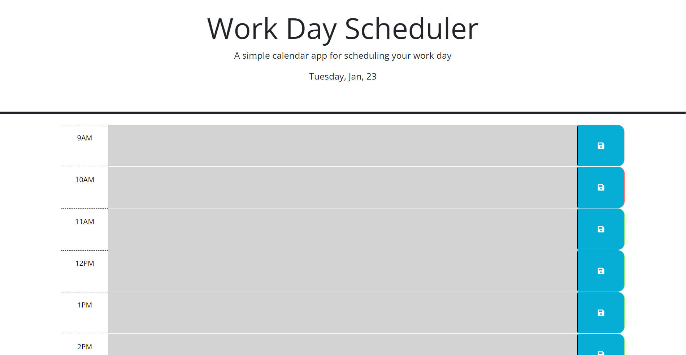

# Code-Day-Planner

## Description

This assigment required me to modify starter code to create a simple calendar application that allows a user to save events for each hour of a typical working day. The app will be running in the browser and will feature dynamically updated HTML and CSS powered by jQuery.

## Installation

N/A

## Usage

 <a href = https://anicabarrios.github.io/Challenge5-Code-Day-Planner/ >Live link</a>

 

## Credits

N/A

## License

Please refer to the LICENSE in the repo.
